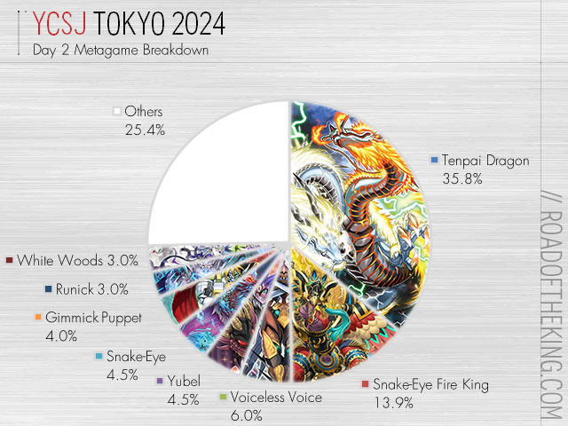

## 含义

在当前环境，较多人使用的卡组。具有相当的竞技实力，在[饼图](/卡组/归类/饼图)上常常排名前列。

## 例子

下图中的天杯龙(Tenpai Dragon)、蛇眼炎王(Snake-Eye Fire King)、肃声(Voiceeless Voice)等，即为当时的主流卡组

图片来源: [road of king](https://roadoftheking.com/ycsj-tokyo-2024/)
