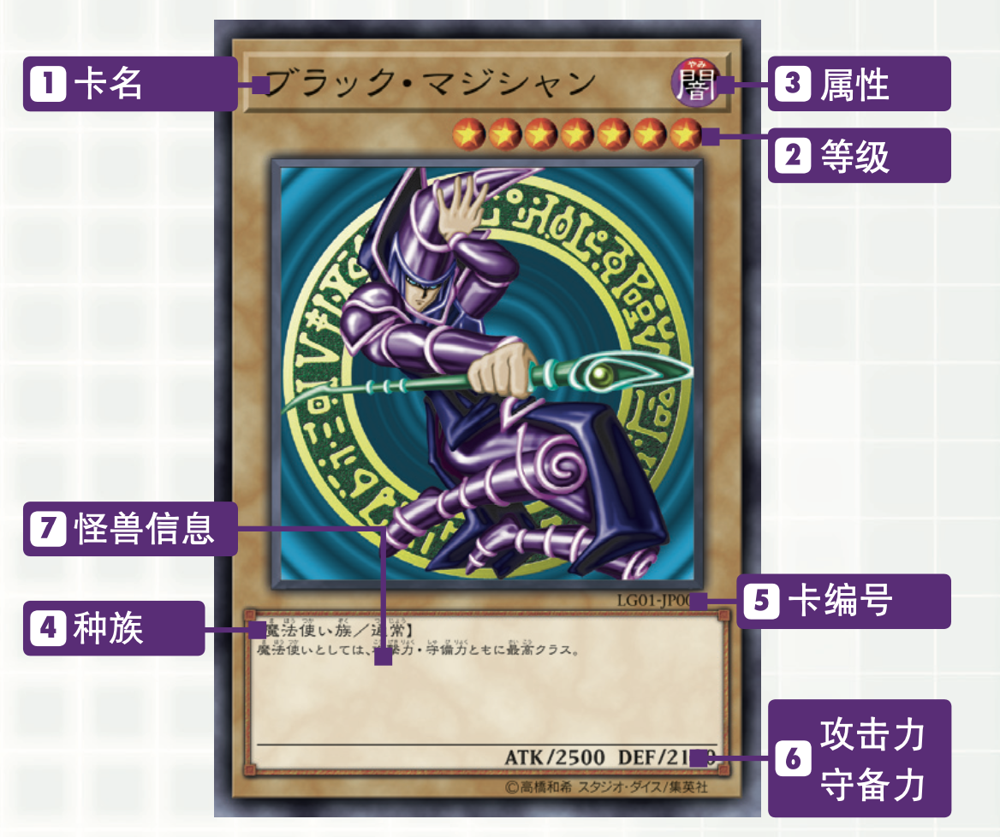
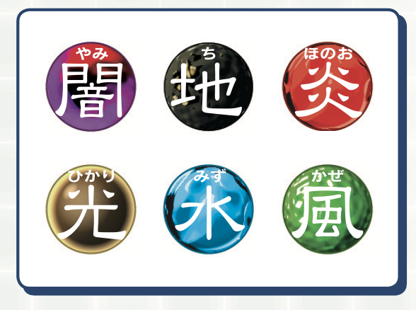
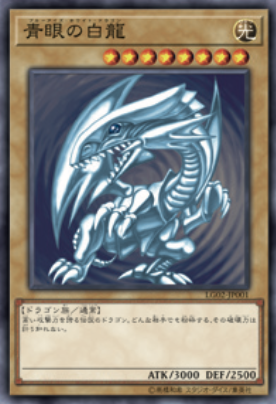
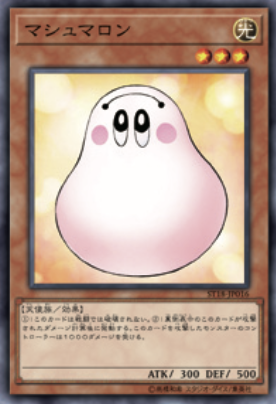
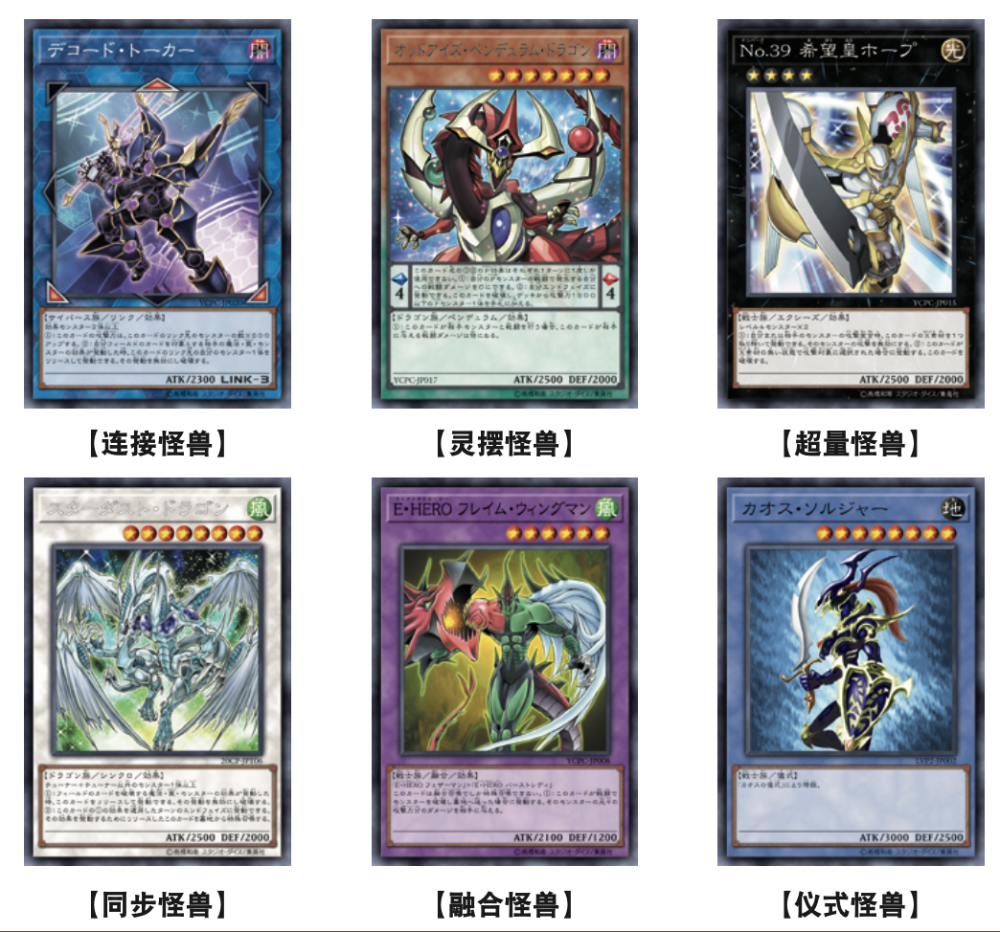

## 定义

怪兽卡是指在战斗中与对手怪兽进行攻防或对对手玩家进行攻击的卡。  
决斗的基本玩法就是使用该卡进行怪兽战斗。

## 怪兽卡的信息

### 1.卡名

此处显示的即为卡名。  
按照规则，即使卡上的图片不同，只要卡名相同就作为同样的卡使用。

### 2. 等级

表示怪兽的等级。等级越高就表示是越强大的怪兽。

### 3. 属性

怪兽分为6种属性（暗、地、炎、光、水、风）。部分卡效果中只对特定属性产生影响。

### 4. 种族

怪兽分为很多个种族。此外，拥有特定能力的怪兽的能力名有时会表示在此处。

例子：魔法师、龙、不死、战士、兽、恶魔、天使、昆虫、恐龙、海龙、机械、水、炎、岩石、电子界、幻想魔

### 5. 卡编号

记载有卡包系列和系列中的通用编号。整理卡或搜索数据时看这块内容会很方便。

### 6. 攻击力・守备力

ATK表示怪兽的攻击力，DEF表示守备力。  
数值越高，就越有利于怪兽之间的战斗。

### 7. 怪兽信息

如果是通常怪兽，就记录其性格、特征等的相关解说。  
如果是其他怪兽，则记录卡的效果和使用方法等。  
此处记录的效果怪兽等的特殊能力在以里侧表示的方式放在场上的情况下一般无法发挥效果，这一点需要注意。

## 怪兽卡的种类

### 通常怪兽

不具有特殊效果的基础怪兽。
正因为不具有效果，其中有很多攻击力和守备力较高的怪兽。

### 效果怪兽

虽然身为怪兽，但可以发挥类似魔法卡效果的就是效果怪兽。

### 其他怪兽卡

除此之外还存在以下这些怪兽卡。这些怪兽可根据特定方法被呼叫出来，发挥出各种效果。

---

来源：[官方规则书之大师规则(2020年4月1日修订版)](https://www.yugioh-card-cn.com/playing)
