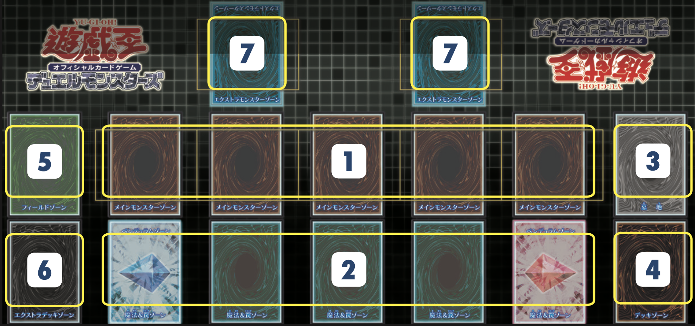

## 定义

决斗场上内，不同卡的摆放位置及其名称均有规定。  

启动牌组等的组合套装中随附的场上为仅表示自己方场上的半面形态。实际游戏的情况下，需要与对手的场上对接在一起进行决斗。

## 图示

1. [主要怪兽区域](/基础篇/场地/主要怪兽区域)
2. [魔法与陷阱区域](/基础篇/场地/魔法与陷阱区域)
3. [墓地](/基础篇/场地/墓地)
4. [牌组区域](/基础篇/场地/牌组区域)
5. [场地区域](/基础篇/场地/场地区域)
6. [额外牌组区域](/基础篇/场地/额外牌组区域)
7. [额外怪兽区域](/基础篇/场地/额外怪兽区域)

---

来源：[官方规则书之大师规则(2020年4月1日修订版)](https://www.yugioh-card-cn.com/playing)
